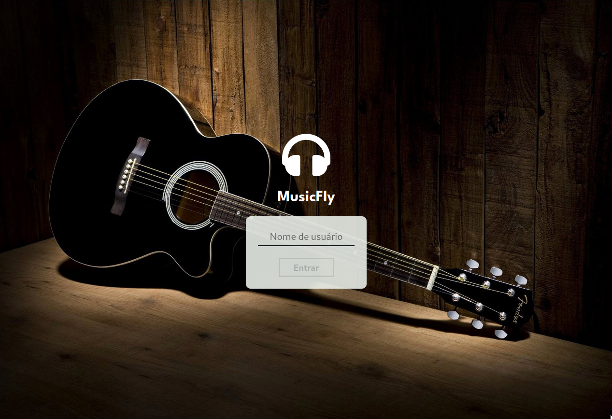

#  MusicFly



## Acesse o projeto clicando <a href="https://eliedson1979.github.io/musicfly/">AQUI</a>

<br />

## 📡 Desenvolvimento

Projeto desenvolvido na <a href="https://betrybe.com/" target="_blank">Trybe</a> durante o módulo de Front-End!

Nesse projeto desenvolvi uma aplicação para ouvir músicas. Consultamos uma API para conseguir as informações de cada álbum e criamos rotas para encaminhar o usuário para cada área da aplicação. 

<br />

## 🚀 Instalação e execução

  <details>
    <summary>Instalando e executando</summary>
    <br />

### 1 - Clone o repositório:

```
git clone git@github.com:Eliedson1979/musicfly.git
```

### 2 - Apos ter o repositório clonado em sua maquina, execute este comando para acessar a pasta do projeto:

```sh
cd musicfly
```

### 3 - Dentro da pasta do projeto, execute o comando abaixo para instalar as dependências do projeto:

Caso utilize o npm:

```sh
npm install
```

Caso utilize o yarn:

```sh
yarn install
```

### 4 - Dentro da pasta do projeto, execute o comando abaixo para iniciar o servidor do projeto:

Caso utilize o npm:

```sh
npm start
```

Caso utilize o yarn:

```sh
yarn start
```

### 5 - Acesse a aplicação:

Abrindo na porta padrão que o React usa: <http://localhost:3000/> em seu navegador.

  </details>
<br />

## ⚙️ Tecnologias

* HTML5
* CSS3
* JavaScript
* React.js
* React Router

